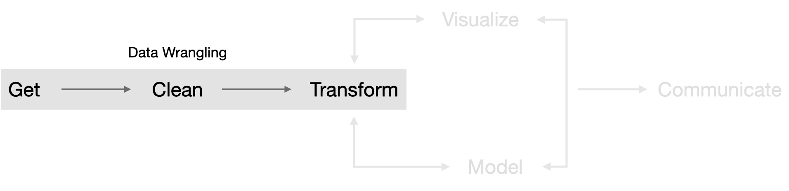

# (PART) Introduction {-}

# The Role of Data Wrangling

> _“Water, water, everywhere, nor any a drop to drink”_ - Samuel Taylor Coleridge

Synonymous to Samuel Taylor Coleridge’s quote in _Rime of the Ancient Mariner_, the degree to which data are useful is largely determined by an analyst’s ability to wrangle data. In spite of advances in technologies for working with data, analysts still spend an inordinate amount of time obtaining data, diagnosing data quality issues and pre-processing data into a usable form. Research has illustrated that this portion of the data analysis process is the most tedious and time consuming component; often consuming 50-80% of an analyst’s time [@tidy-data; @dasu2003exploratory]. Despite the challenges, data wrangling remains a fundamental building block that enables visualization and statistical modeling. Only through data wrangling can we make data useful. Consequently, one’s ability to perform data wrangling tasks effectively and efficiently is fundamental to becoming an expert data analyst in their respective domain.

So what exactly is this thing called data wrangling? It’s the ability to take a messy, unrefined source of data and wrangle it into something useful. It’s the art of using computer programming to extract raw data and creating clear and actionable bits of information for your analysis. Data wrangling is the entire front end of the analytic process and requires numerous tasks that can be categorized within the get, clean, and transform components.

```{r modeling-process-modeling-process, echo=FALSE, fig.cap="Data wrangling portion of the analytic cycle portrayed in @wickham2016r.", dpi = 300}

```

However, learning how to wrangle your data does not necessarily follow a linear progression as suggested by the above figure. In fact, you need to start from scratch to understand how to work with data in R. Consequently, this book takes a meandering route through the data wrangling process to help build a solid data wrangling foundation.

First, modern day data wrangling requires being comfortable writing code. If you are new to writing code, R, or RStudio you need to understand some of the basics of working in the “command line” environment. The next two chapters in this section will introduce you to R, discuss the benefits it provides, and then start to get you comfortable at the command line by walking you through the process of assigning and evaluating expressions, using vectorization, getting help, managing your workspace, and working with packages. Lastly, I offer some basic styling guidelines to help you write code that is easier to digest by others.

Second, data wrangling requires the ability to work with different forms of data. Analysts and organizations are finding new and unique ways to leverage all forms of data so it’s important to be able to work not only with numbers but also with character strings, categorical variables, logical variables, regular expression, and dates. Section two explains how to work with these different classes of data so that when you start to learn how to manage the different data structures, which combines these data classes into multiple dimensions, you will have a strong knowledge base.

Third, modern day datasets often contain variables of different lengths and classes. Furthermore, many statistical and mathematical calculations operate on different types of data structures. Consequently, data wrangling requires a strong knowledge of the different structures to hold your datasets. Section three covers the different types of data structures available in R, how they differ by dimensionality and how to create, add to, and subset the various data structures. Lastly, I cover how to deal with missing values in data structures. Consequently, this section provides a robust understanding of managing various forms of datasets.

Fourth, data are arriving from multiple sources at an alarming rate and analysts and organizations are seeking ways to leverage these new sources of information. Consequently, analysts need to understand how to get data from these sources. Furthermore, since analysis is often a collaborative effort, analysts also need to know how to share their data. Section four covers the basics of importing tabular and spreadsheet data, scraping data stored online, and exporting data for sharing purposes.

Fifth, minimizing duplication and writing simple and readable code is important to becoming an effective and efficient data analyst. Moreover, clarity should always be a goal throughout the data analysis process. Sections five and six introduces the use of control flow, functional programming, and writing your own functions to reduce redundancy in code. Section six also introduces you to parallel computing and Rcpp to gain further efficiencies in your computation.  Consequently, these sections will help you to perform data wrangling tasks more effectively, efficiently, and with more clarity.

Six, data scientists need to understand different workflows for executing and storing their code along with efficient ways to deliver output. This can include batching individual R scripts from the command line, organizing code into projects, automating reports, and _ALWAYS_ using version control. Section seven will introduce you to some of these workflows.

Seven, the bread and butter of data wrangling is in reshaping, transforming, summarizing, and joining data sets. Having a solid foundation of these concepts not only makes your data analysis more efficient but helps you to transcend common data wrangling processes across multiple languages. Simply understanding common concepts like `<select>`, `<group by>`, `<summarize>`, and `<join>` will provide you essential knowledge to easily execute these tasks not only in R but also in SQL, Python, and Spark. Section eight will provide you with these tools.

Eight, data analysis in organizations usually requires you to access data from some database location. Moreover, with the amount of data being collected, you often will need to use the some distributed cluster computing framework to perform your analysis. Section nine will introduce you to working with SQL databases from within R and also to use Spark for distributed computing purposes.

Individually, each section will provide you important tools for performing individual data wrangling tasks. Combined, these tools will help to make you more effective and efficient in the front end of the data analysis process so that you can spend more of your time visualizing and modeling your data and communicating your results. In the final section I offer several case studies that requires you to practice combining the skills you've learned throughout this book.