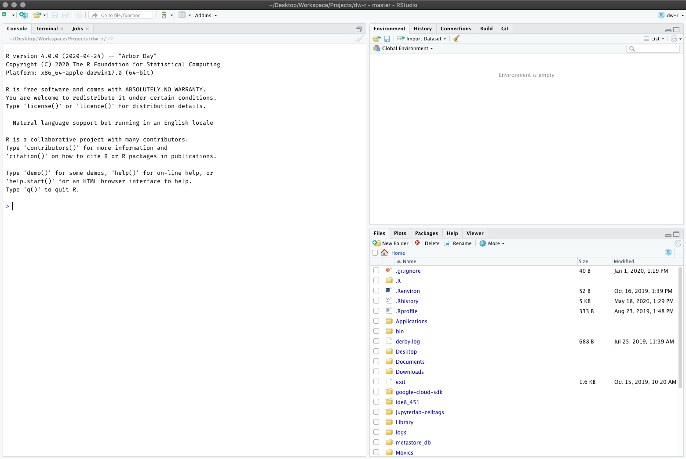

# Getting Started with R & RStudio

> _"Programming is like kicking yourself in the face, sooner or later your nose will bleed."_ - Kyle Woodbury

A computer language is described by its syntax and semantics; where syntax is about the grammar of the language and semantics the meaning behind the sentence. And jumping into a new programming language correlates to visiting a foreign country with only that 9th grade Spanish 101 class under your belt; there is no better way to learn than to immerse yourself in the environment! Although it’ll be painful early on and your nose will surely bleed, eventually you’ll learn the dialect and the quirks that come along with it. 

Throughout this book you’ll learn much of the fundamental syntax and semantics of the R programming language; and hopefully with minimal face kicking involved. However, this chapter serves to introduce you to many of the basics of R to get you comfortable. This includes installing R and RStudio, understanding the console, how to get help, how to work with packages, understanding how to assign and evaluate expressions, and the idea of vectorization. Finally, I offer some basic styling guidelines to help you write code that is easier to digest by others. 

## Installing R and RStudio

First, you need to download and install R, a free software environment for statistical computing and graphics from CRAN, the Comprehensive R Archive Network. It is highly recommended to install a precompiled binary distribution for your operating system; follow these instructions:

1. Go to https://cran.r-project.org/
2. Click “Download R for Mac/Windows”
3. Download the appropriate file:
   a. Windows users click Base, and download the installer for the latest R version
   b. Mac users select the file R-4.X.X.pkg that aligns with your OS version
4. Follow the instructions of the installer

Next, you can download RStudio’s IDE (integrated development environment), a powerful user interface for R. RStudio includes a text editor, so you do not have to install another stand-alone editor. Follow these instructions: 

1. Go to RStudio for desktop https://www.rstudio.com/products/rstudio/download/
2. Select the install file for your OS
3. Follow the instructions of the installer.

There are other R IDE’s available: Emacs, Microsoft R Open, Notepad++, etc; however, I have found RStudio to be my preferred route. When you are done installing RStudio click on the icon that looks like:

```{r rstudio-icon, echo=FALSE, fig.cap='RStudio icon', fig.align='center', out.height="25%", out.width="25%"}
knitr::include_graphics("https://pbs.twimg.com/profile_images/1111468813919252490/YYMiHBTH_400x400.png")
```

and you should get a window that looks like the following:

```{r rstudio-console, echo=FALSE, fig.cap='RStudio console', fig.align='center'}

```

You are now ready to start programming!

## Understanding the Console

The RStudio console is where all the action happens. There are four fundamental windows in the console, each with their own purpose. I discuss each briefly below but I highly suggest Oscar Torres-Reyna’s Introduction to RStudio for a thorough understanding of the console^[You can access this tutorial at http://dss.princeton.edu/training/RStudio101.pdf. Note that although it is from 2013 it still is very applicable and does a very thorough introduction].

```{r rstudio-console-notation, echo=FALSE, fig.cap='The four fundamental windows within the RStudio IDE', fig.align='center'}
knitr::include_graphics("http://uc-r.github.io/public/images/RStudio_console.png")
```

### Script Editor

The top left window is where your script files will display. There are multiple forms of script files but the basic one to start with is the .R file. To create a new file you use the __File » New File__ menu. To open an existing file you use either the __File » Open File…__ menu or the __Recent Files__ menu to select from recently opened files. RStudio’s source editor includes a variety of productivity enhancing features including syntax highlighting, code completion, multiple-file editing, and find/replace. A good introduction to the script editor was written by RStudio’s Josh Paulson^[You can assess the script editor tutorial at https://support.rstudio.com/hc/en-us/articles/200484448-Editing-and-Executing-Code].

The script editor is a great place to put code you care about. Keep experimenting in the console, but once you have written code that works and does what you want, put it in the script editor. RStudio will automatically save the contents of the editor when you quit RStudio, and will automatically load it when you re-open. Nevertheless, it’s a good idea to save your scripts regularly and to back them up.

To execute the code in the script editor you have two options:

1. Place the cursor on the line that you would like to execute and execute Cmd/Ctrl + Enter. Alternatively, you could hit the __Run__ button in the toolbar.
2. If you want to run _all_ lines of code in the script then you can highlight the lines you want to run and then execute one of the options in #1.

```{r rstudio-script-runner, echo=FALSE, fig.cap='Execute lines of code in your script with Cmd/Ctrl + Enter or using the __Run__ button.', fig.align='center'}
knitr::include_graphics("http://uc-r.github.io/public/images/run_code.png")
```

### Workspace Environment

The top right window is the workspace environment which captures much of your your current R working environment and includes any user-defined objects (vectors, matrices, data frames, lists, functions). When saving your R working session, these are the components along with the script files that will be saved in your working directory, which is the default location for all file inputs and outputs. To get or set your working directory so you can direct where your files are saved:

```{r, eval=FALSE}
# returns path for the current working directory
getwd()                  

# set the working directory to a specified directory
setwd("path/of/directory")   
```

For example, if I call `getwd()` the file path "/Users/b294776/Desktop/Workspace/Projects/dw-r" is returned. If I want to set the working directory to the “Workspace” folder within the “Desktop” directory I would use `setwd("/Users/b294776/Desktop/Workspace")`. Now if I call `getwd()` again it returns “/Users/b294776/Desktop/Workspace”. An alternative solution is to go to the following location in your toolbar __Session » Set Working Directory » Choose Directory__ and select the directory of choice (much easier!).

The workspace environment will also list your user defined objects such as vectors, matrices, data frames, lists, and functions. For example, if you type the following in your console:

```{r, eval=FALSE}
x <- 2
y <- 3
```

You will now see `x` and `y` listed in your workspace environment. To identify or remove the objects (i.e. vectors, data frames, user defined functions, etc.) in your current R environment:

```{r, eval=FALSE}
# list all objects
ls()              

# identify if an R object with a given name is present
exists("x")        

# remove defined object from the environment
rm(x)            

# you can remove multiple objects
rm(x, y)  

# basically removes everything in the working environment -- use with caution!
rm(list = ls())    
```

```{block, type='tip'}
If you have a lot of objects in your workspace environment you can use the 🧹 icon in the workspace environment tab to clear out everything.
```

You can also view previous commands in the workspace environment by clicking the __History__ tab, by simply pressing the up arrow on your keyboard, or by typing into the console:

```{r, eval=FALSE}
# default shows 25 most recent commands
history()        

# show 100 most recent commands
history(100)     

# show entire saved history
history(Inf)  
```

### Console

The bottom left window contains the console. You can code directly in this window but it will not save your code. It is best to use this window when you are simply wanting to perform calculator type functions. This is also where your outputs will be presented when you run code in your script. Go ahead and type the following in your console:

```{r, eval=FALSE}
2 * 3 + 8 / 2
```

### Misc. Displays

The bottom right window contains multiple tabs. The __Files__ tab allows you to see which files are available in your working directory. The __Plots__ tab will display any plots/graphics that are produced by your code. The __Packages__ tab will list all packages downloaded to your computer and also the ones that are loaded (more on this later). And the __Help__ tab allows you to search for topics you need help on and will also display any help responses (more on this later as well).

### Workspace Options & Shortcuts

There are multiple options available for you to set and customize both R and your RStudio console. For R, you can read about, and set, available options for the current R session with the following code. For now you don’t need to worry about making any adjustments, just know that many options do exist.

```{r, eval=FALSE}
# learn about available options
help(options)

# view current option settings
options()            

# change a specific option (i.e. number of digits to print on output)
options(digits=3)  
```

For a thorough tutorial regarding the RStudio console and how to customize different components check out this [tutorial](http://dss.princeton.edu/training/RStudio101.pdf). You can also find the RStudio console cheatsheet shown below [here](https://www.rstudio.com/wp-content/uploads/2016/01/rstudio-IDE-cheatsheet.pdf) or by going to __Help menu » Cheatsheets__. As with most computer programs, there are numerous keyboard shortcuts for working with the console. To access a menu displaying all the shortcuts in RStudio you can use option + shift + k. Within RStudio you can also access them in the __Help menu » Keyboard__ Shortcuts.

```{r rstudio-cheat-sheet, echo=FALSE, fig.cap='RStudio IDE cheat sheet.', fig.align='center'}
knitr::include_graphics("https://raw.githubusercontent.com/uc-r/uc-r.github.io/master/public/images/RStudio%20Cheatsheet.png")
```

### Exercises

1. Identify what working directory you are working out of.
2. Create a folder on your computer titled _Learning R_. Within R, set your working directory to this folder.
3. Type `pi` in the console. Set the option to show 8 digits. Re-type `pi` in the console.
4. Type `?pi` in the console. Note that documentation on this object pops up in the Help tab in the Misc. Display.
5. Now check out your code History tab.
6. Create a new .R file and save this as _my-first-script_ (note how this now appears in your _Learning R_ folder). Type `pi` in line 1 of this script, `option(digits = 8)` in line 2, and `pi` again in line three. Execute this code one line at a time and then re-execute all lines at once.


## Getting Help


## Working with Packages


## Assignment & Evaluation


## Vectorization


## Style Guide