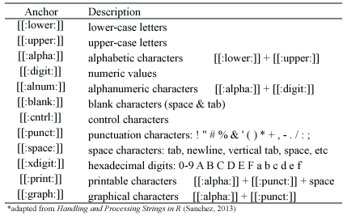

# Dealing with Regular Expressions

```{r setup, include=FALSE}
knitr::opts_chunk$set(
  fig.align = "center",
  collapse = TRUE
)
```

A regular expression (aka regex) is a sequence of characters that define a search pattern, mainly for use in pattern matching with text strings. Typically, regex patterns consist of a combination of alphanumeric characters as well as special characters. The pattern can also be as simple as a single character or it can be more complex and include several characters.

```{block, type="note"}
Regex are not a specific data type; however, to work efficiently with character strings you will likely need to understand some basic regex.
```

To understand how to work with regular expressions in R, we need to consider two primary features of regular expressions. One has to do with the syntax, or the way regex patterns are expressed in R. The other has to do with the functions used for regex matching in R. In this chapter, we will cover both of these aspects. First, I cover the syntax that allows you to perform pattern matching functions with meta characters, character and POSIX classes, and quantifiers. This will provide you with the basic understanding of the syntax required to establish the pattern to find. Then I cover the  functions provided in base R and in the __stringr__ package you can apply to identify, extract, replace, and split parts of character strings based on the regex pattern specified. 

## Regex Syntax
At first glance (and second, third,...) the regex syntax can appear quite confusing.  This section will provide you with the basic foundation of regex syntax; however, realize that there is a plethora of [resources available](#regex_resources) that will give you far more detailed, and advanced, knowledge of regex syntax.  To read more about the specifications and technicalities of regex in R you can find help at `help(regex)` or `help(regexp)`.

### Metacharacters
Metacharacters consist of non-alphanumeric symbols such as `.  \  |  (  )  [  {  $  *  + ?`. To match metacharacters in R you need to escape them with a double backslash "\\".  The following displays the general escape syntax for the most common metacharacters:

```{r metacharacter, echo=FALSE, fig.cap="Escape syntax for common metacharacters."}

```

The following provides examples to show how to use the escape syntax to find and replace metacharacters.  For information on the `sub` and `gsub` functions used in this example visit the [main regex functions section](#regex_functions_base). 


```{r}
# substitute $ with !
sub(pattern = "\\$", "\\!", "I love R$")

# substitute ^ with carrot
sub(pattern = "\\^", "carrot", "My daughter has a ^ with almost every meal!")

# substitute \\ with whitespace
gsub(pattern = "\\\\", " ", "I\\need\\space")
```

### Sequences
To match a sequence of characters we can apply short-hand notation which captures the fundamental types of sequences.  The following displays the general syntax for these common sequences:

```{r sequence-anchors, echo=FALSE, fig.cap="Anchors for common sequences."}
knitr::include_graphics("figures/anchor_sequence.png")
```
    
The following provides examples to show how to use the anchor syntax to find and replace sequences.  For information on the `gsub` function used in this example visit the [main regex functions section](#regex_functions_base).


```{r}
# substitute any digit with an underscore
gsub(pattern = "\\d", "_", "I'm working in RStudio v1.2.5042")

# substitute any non-digit with an underscore
gsub(pattern = "\\D", "_", "I'm working in RStudio v1.2.5042")

# substitute any whitespace with underscore
gsub(pattern = "\\s", "_", "I'm working in RStudio v1.2.5042")

# substitute any wording with underscore
gsub(pattern = "\\w", "_", "I'm working in RStudio v1.2.5042")
```


### Character classes
To match one of several characters in a specified set we can enclose the characters of concern with square brackets [ ].  In addition, to match any characters **not** in a specified character set we can include the caret ^ at the beginning of the set within the brackets.  The following displays the general syntax for common character classes but these can be altered easily as shown in the examples that follow:

```{r character-class, echo=FALSE, fig.cap="Anchors for common character classes."}
knitr::include_graphics("figures/character_class.png")
```

The following provides examples to show how to use the anchor syntax to match character classes.  For information on the `grep` function used in this example visit the [main regex functions section](#regex_functions_base).

```{r}
x <- c("RStudio", "v1.2.5042", "2020", "09-22-2020", "grep vs. grepl")

# find any strings with numeric values between 0-9
grep(pattern = "[0-9]", x, value = TRUE)

# find any strings with numeric values between 6-9
grep(pattern = "[6-9]", x, value = TRUE)

# find any strings with the character R or r
grep(pattern = "[Rr]", x, value = TRUE)

# find any strings that have non-alphanumeric characters
grep(pattern = "[^0-9a-zA-Z]", x, value = TRUE)
```

### POSIX character classes
Closely related to regex [character classes](#character_class) are POSIX character classes which are expressed in double brackets [[ ]].

```{r posix, echo=FALSE, fig.cap="POSIX Character Classes."}

```

The following provides examples to show how to use the anchor syntax to match POSIX character classes. For information on the `grep` function used in this example visit the [main regex functions section](#regex_functions_base).

```{r}
x <- "I like beer! #beer, @wheres_my_beer, I like R (v4.0.0) #rrrrrrr2020"

# remove space or tabs
gsub(pattern = "[[:blank:]]", replacement = "", x)

# replace punctuation with whitespace
gsub(pattern = "[[:punct:]]", replacement = " ", x)

# remove alphanumeric characters
gsub(pattern = "[[:alnum:]]", replacement = "", x)
```

### Quantifiers
When we want to match a **certain number** of characters that meet a certain criteria we can apply quantifiers to our pattern searches.  The quantifiers we can use are:

```{r quantifiers, echo=FALSE, fig.cap="Quantifiers in R."}
knitr::include_graphics("figures/quantifier.png")
```

The following provides examples to show how to use the quantifier syntax to match a **certain number** of characters patterns. For information on the `grep` function used in this example visit the [main regex functions section](#regex_functions_base).  Note that `state.name` is a built in dataset within R that contains all the U.S. state names.

```{r}
# match states that contain z 
grep(pattern = "z+", state.name, value = TRUE)

# match states with two s
grep(pattern = "s{2}", state.name, value = TRUE)

# match states with one or two s
grep(pattern = "s{1,2}", state.name, value = TRUE)
```


## Regex Functions in Base R {#regex_functions_base}
R contains a set of functions in the base package that we can use to find pattern matches.  Alternatively, the R package __stringr__ also provides [several functions](#regex_functions_stringr) for regex operations.  This section covers the base R functions that provide [pattern finding](#pattern_find), [pattern replacement](#replacement), and [string splitting capabilities](#splitting).

### Pattern Finding Functions {#pattern_find}
There are five functions that provide pattern matching capabilities.  The three functions that I provide examples for are ones that are most common.  The two other functions which I do not illustrate are `gregexpr()` and `regexec()` which provide similar capabilities as `regexpr()` but with the output in list form.

* Pattern matching with values or indices as outputs
* Pattern matching with logical (`TRUE`/`FALSE`) outputs
* Identifying the location in the string where the patter exists

#### grep( )
To find a pattern in a character vector and to have the element values or indices as the output use `grep()`:

```{r}
# use the built in data set `state.division`
head(as.character(state.division))

# find the elements which match the patter
grep("North", state.division)

# use 'value = TRUE' to show the element value
grep("North", state.division, value = TRUE)

# can use the 'invert' argument to show the non-matching elements
grep("North | South", state.division, invert = TRUE)
```


#### grepl( )
To find a pattern in a character vector and to have logical (`TRUE`/`FALSE`) outputs use `grep()`:

```{r}
grepl("North | South", state.division)

# wrap in sum() to get the count of matches
sum(grepl("North | South", state.division))
```


#### regexpr( )
To find exactly where the pattern exists in a string use `regexpr()`:

```{r}
x <- c("v.111", "0v.11", "00v.1", "000v.", "00000")

regexpr("v.", x)
```

The output of `regexpr()` can be interepreted as follows.  The first element provides the starting position of the match in each element.  Note that the value **-1** means there is no match.  The second element (attribute "match length") provides the length of the match.  The third element (attribute "useBytes") has a value TRUE meaning matching was done byte-by-byte rather than character-by-character.

### Pattern Replacement Functions {#replacement}
In addition to finding patterns in character vectors, its also common to want to replace a pattern in a string with a new patter.  There are two options for this:

* Replace the first occurrence
* Replace all occurrences

#### sub( )
To replace the **first** matching occurrence of a pattern use `sub()`:

```{r}
new <- c("New York", "new new York", "New New New York")
new

# Default is case sensitive
sub("New", replacement = "Old", new)

# use 'ignore.case = TRUE' to perform the obvious
sub("New", replacement = "Old", new, ignore.case = TRUE)
```

#### gsub( )
To replace **all** matching occurrences of a pattern use `gsub()`:

```{r}
# Default is case sensitive
gsub("New", replacement = "Old", new)

# use 'ignore.case = TRUE' to perform the obvious
gsub("New", replacement = "Old", new, ignore.case = TRUE)
```

### Splitting Character Vectors {#splitting}
To split the elements of a character string use `strsplit()`:

```{r}
x <- paste(state.name[1:10], collapse = " ")

# output will be a list
strsplit(x, " ")

# output as a vector rather than a list
unlist(strsplit(x, " "))
```


## Regex Functions with stringr {#regex_functions_stringr}
Similar to basic string manipulation, the __stringr__ package also offers regex functionality.  In some cases the __stringr__ performs the same functions as certain base R functions but with more consistent syntax.  In other cases __stringr__ offers additional functionality that is not available in the base R functions.  The __stringr__ functions we'll cover focus on [detecting](#h1_stringr), [locating](#h2_stringr), [extracting](#h3_stringr), and [replacing patterns](#h4_stringr) along with string [splitting](#h5_stringr).

```{r, eval=FALSE}
# install stringr package
install.packages("stringr")

# load package
library(stringr)
```

```{r, echo=FALSE, include=FALSE}
library(stringr)
```


### Detecting Patterns {#h1_stringr}
To *detect* whether a pattern is present (or absent) in a string vector use the `str_detect()`. This function is a wrapper for [`grepl()`](#regex_functions_base#grepl).


```{r}
# use the built in data set 'state.name'
head(state.name)

str_detect(state.name, pattern = "New")

# count the total matches by wrapping with sum
sum(str_detect(state.name, pattern = "New"))
```

### Locating Patterns {#h2_stringr}
To *locate* the occurrences of patterns __stringr__ offers two options: *i*) locate the first matching occurrence or *ii*) locate all occurrences.  To locate the position of the first occurrence of a pattern in a string vector use `str_locate()`. The output provides the starting and ending position of the first match found within each element.

```{r}
x <- c("abcd", "a22bc1d", "ab3453cd46", "a1bc44d")

# locate 1st sequence of 1 or more consecutive numbers
str_locate(x, "[0-9]+")
```

To locate the positions of all pattern match occurrences in a character vector use `str_locate_all()`.  The output provides a list the same length as the number of elements in the vector.  Each list item will provide the starting and ending positions for each pattern match occurrence in its respective element.

```{r}
# locate all sequences of 1 or more consecutive numbers
str_locate_all(x, "[0-9]+")
```

### Extracting Patterns {#h3_stringr}
For extracting a string containing a pattern, __stringr__ offers two primary options: *i*) extract the first matching occurrence or *ii*) extract all occurrences.  To extract the first occurrence of a pattern in a character vector use `str_extract()`. The output will be the same length as the string and if no match is found the output will be `NA` for that element.

```{r}
y <- c("I use R #useR202019", "I use R and love R #useR2020", "Beer")

str_extract(y, pattern = "R")
```

To extract all occurrences of a pattern in a character vector use `str_extract_all()`.  The output provides a list the same length as the number of elements in the vector.  Each list item will provide the matching pattern occurrence within that relative vector element.

```{r}
str_extract_all(y, pattern = "[[:punct:]]*[a-zA-Z0-9]*R[a-zA-Z0-9]*")
```

### Replacing Patterns {#h4_stringr}
For extracting a string containing a pattern, __stringr__ offers two options: *i*) replace the first matching occurrence or *ii*) replace all occurrences.  To replace the first occurrence of a pattern in a character vector use `str_replace()`. This function is a wrapper for [`sub()`](#regex_functions_base#sub).


```{r}
cities <- c("New York", "new new York", "New New New York")
cities

# case sensitive
str_replace(cities, pattern = "New", replacement = "Old")

# to deal with case sensitivities use Regex syntax in the 'pattern' argument
str_replace(cities, pattern = "[N]*[n]*ew", replacement = "Old")
```

To extract all occurrences of a pattern in a character vector use `str_replace_all()`.  This function is a wrapper for [`gsub()`](#regex_functions_base#gsub).

```{r}
str_replace_all(cities, pattern = "[N]*[n]*ew", replacement = "Old")
```

### String Splitting {#h5_stringr}
To split the elements of a character string use `str_split()`. This function is a wrapper for [`strsplit()`](#regex_functions_base#splitting).

```{r}
z <- "The day after I will take a break and drink a beer."
str_split(z, pattern = " ")

a <- "Alabama-Alaska-Arizona-Arkansas-California"
str_split(a, pattern = "-")
```

Note that the output of `strs_plit()` is a list.  To convert the output to a simple atomic vector simply wrap in `unlist()`:

```{r}
unlist(str_split(a, pattern = "-"))
```

## Additional Resources {#regex_resources}
Character string data are often considered semi-structured data.  Text can be structured in a specified field; however, the quality and consistency of the text input can be far from structured.  Consequently, managing and manipulating character strings can be extremely tedious and unique to each data wrangling process.  As a result, taking the time to learn the nuances of dealing with character strings and regex functions can provide a great return on investment; however, the functions and techniques required will likey be greater than what I could offer here.  So here are additional resources that are worth reading and learning from:

* [Handling and Processing Strings in R](http://gastonsanchez.com/Handling_and_Processing_Strings_in_R.pdf) [@sanchez2013handling]
* [__stringr__ Package Vignette](https://cran.r-project.org/web/packages/stringr/vignettes/stringr.html)
* [Regular Expressions](http://www.regular-expressions.info/)

## Exercises

```{block, type='todo'}
TBD
```